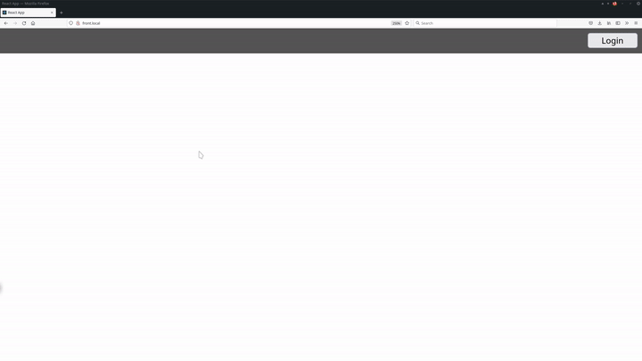

# Introducción

Aplicación fullstack, con frontend en TS y backend en JS, ambos comunicandose por GraphQL. Uso de MongoDB y Redis para persistencia y manejo de tokens de sesion respectivamente. Almacenamiento en Azure Storage Blobs, con subida y borrado de imagenes desde mi cliente. Despliegue de la infraestructura en Terraform y Ansible, con una comparación detallada de las herramientas en `documentacion/latex/memoria.pdf`. Tres playbooks de ansible, uno secuencial, otro con tareas asincronas y roles free para paralelismo, y otro usando Terraform desde Ansible.

   

# Requisitos
- Cuenta de azure
- `az-cli`
- `docker`
- `terraform`
- `ansible`

## Colección de azure para ansible
> ansible-galaxy collection install azure.azcollection

> pip3 install -r ~/.ansible/collections/ansible_collections/azure/azcollection/requirements-azure.txt

   

# Despliegue con Terraform
El script terraform-deploy.sh contiene todos los pasos salvo la creación de los archivos `variables.tfvars` con los valores correctos, y el login. Es necesario actualizar el script para que tenga los nombres del ACR correctos

> az login

Partiendo en cada caso de la raiz del proyecto:

## Despliegue de la infraestructura principal
> cd terraform 

Cambiar el nombre del archivo `examplevariables.tfvars` a `variables.tfvars` y rellenarlo

> terraform -out miplan.out -var-file variables.tfvars

> terraform apply miplan.out

## Comun para los dos contenedores
> az acr login -n `<acr-name>`

### Desplegar el backend
> cd backend

> docker build -t fullstackpoc-back:1.0.0 .

> docker tag fullstackpoc-back:1.0.0 `<acr-name>`.azurecr.io/fullstackpoc-back:latest

> docker push `<acr-name>`.azurecr.io/fullstackpoc-back:latest

> cd terraform

Cambiar el nombre del archivo `examplevariables.tfvars` a `variables.tfvars` y rellenarlo. 

<!-- La variable `whitelisted_ip` deberia tener las IPs de todos los que tengan que acceder por el frontend. `curl ifconfig.me` -->

> terraform -out miplan.out -var-file variables.tfvars

> terraform apply miplan.out

### Desplegar el frontend
> cd frontend

> docker build -t fullstackpoc-front:1.0.0 .

> docker tag fullstackpoc-front:1.0.0 `<acr-name>`.azurecr.io/fullstackpoc-front:latest

> docker push `<acr-name>`.azurecr.io/fullstackpoc-front:latest

> cd terraform

Cambiar el nombre del archivo `examplevariables.tfvars` a `variables.tfvars` y rellenarlo

> terraform -out miplan.out -var-file variables.tfvars

> terraform apply miplan.out

   

# Despliegue con Ansible
Cambiar el nombre de los archivos `examplemain.yml` a `main.yml` en la carpeta `/vars` de cada rol en el playbook que se quiera ejecutar y rellenarlo con los valores adecuados. 

> az login

> ansible-playbook site.yml

En el playbook `parallel_ansible` hay dos playbooks, `site.yml` y `parallel-site.yml`, el segundo utiliza la estrategia *free* para los roles de docker. 

Se pueden elegir que roles ejecutar con las opciones `--tags "A,B"` y `--skip-tags "C,D"` detrás del comando de ansible-playbook. En los archivos `site.yml` se pueden ver las etiquetas que he asignado a cada rol.