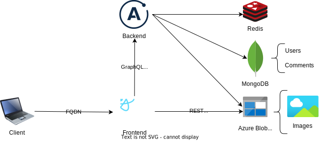

<br>

# Introduction
This repo contains a fullstack webapp and the Ansible and Terraform code to deploy it in Azure. It has frontend and backend servers, written in TypeScript and JavaScript respectively. I used React and Emotion for the frontend. Both use GraphQL, with Apollo Client and Server. I used MongoDB for persistance, and a Redis cache to store user session tokens. To handle images (with user uploads and deletion) I used Azure Blob Storage.

<br>

<p align="center">
  <br>
  <em>General overview</em>
</p>

Users can view all posts, register, log in and out, and make and delete their own posts. These contain their author's name, a comment and an image. Only the author of a post can delete it, this is checked both in the client and API.

<br>

<p align="center">
  <br>
  <em>Project demo</em>
</p>

<br>

## Table of Contents
- [Introduction](#Introduction)
  - [Requirements](https://github.com/oscarsalvador/NEB-practica-empresa-1#requirements)
  - [How to deploy (quick)](https://github.com/oscarsalvador/NEB-practica-empresa-1#How-to-deploy)
- [Repo structure](https://github.com/oscarsalvador/NEB-practica-empresa-1#Repo-structure)
- [Infrastructure](https://github.com/oscarsalvador/NEB-practica-empresa-1#Infrastructure)
  - [Terraform deployment](https://github.com/oscarsalvador/NEB-practica-empresa-1#Terraform-deployment)
  - [Ansible deployment](https://github.com/oscarsalvador/NEB-practica-empresa-1#Ansible-deployment)
  
<br>


## Requierements
- Azure subscription
- `az-cli`
- `docker`
- `terraform`
- `ansible`
  - Ansible's azure collection

### Installation of Ansible's collection for Azure
```
ansible-galaxy collection install azure.azcollection
pip3 install -r ~/.ansible/collections/ansible_collections/azure/azcollection/requirements-azure.txt
```

<br>

## How to deploy
The system can be deployed with Ansible, Terraform or both. Before getting to try this project out with either IaC tool, it is necessary fill out the variable files that feed these tools the values they need. I have uploaded examples for both, without the values. 
  - In every Terraform folder (`terraform`, `backend/terraform` and `frontend/terraform`) there's a `examplevariables.tfvars` file that needs to be filled, and renamed to `variables.tfvars`. The bash script `terraform/terraform-deploy.sh` receives the ACR name as a parameter.
  - In every role (`roles/<role-name>/`) of the Ansible playbook that you pick, there's a `vars/examplemain.yml` file to fill and rename as `vars/main.yml` too.

With these values and the requirements satisfied, the system can be deployed. After logging into Azure with `az login`, run either of the following:
  - Ansible:
    ```
      cd ansible/parallel_ansible
      ansible-playbook site.yml
    ```
  - Terraform:
    ```
      terraform/terraform-deploy.sh <YOUR-ACR-NAME-HERE>
    ```


<br><br></br>

# Repo structure

| Directory                         | Description                                                                     |
| --------------------------------- | ------------------------------------------------------------------------------- |
| Root              |                                                                                 | 
| `├─` ansible                      | Contains all playbooks                                                          | 
| `│` &emsp; `├─` ansible           | My first playbook, the bare minimum to provision the project's needs in Azure   |
| `│` &emsp; `├─` parallel_ansible  | An improved playbook, using asynchronous tasks and roles to get a big speed up  |
| `│` &emsp; `└─` terraform_ansible | Simple playbook to test the integration of Terraform in Ansible                 |
| `├─` backend                      | Contains all files related to the backend server                                | 
| `│` &emsp; `├─` src               | JavaScript source files for the API server                                      |
| `│` &emsp; `└─` terraform         | Terraform project to deploy the backend's image as an Azure Container Instance  |
| `├─` documentacion                | Files related to the LaTeX lab report I made on this project                    | 
| `├─` frontend                     | Contains all files related to the frontend server                               | 
| `│` &emsp; `├─` src               | TypeScript source files for the webclient, to be served by the frontend         |
| `│` &emsp; `└─` terraform         | Terraform project to deploy the frontend's image as an Azure Container Instance |
| `└─` terraform                    | Terraform project for the base components, used by both backend and frontend    | 

There are three different Ansible playbooks, *ansible* and *parallel_ansible* differ in the use of asynchronous tasks and roles. On the other hand, *terraform_ansible* uses my terraform folders with the community collection's Terraform module. 

I also wrote a 65 page, in-depth [report](https://github.com/oscarsalvador/NEB-practica-empresa-1/blob/master/documentacion/latex/NEB_practica_empresa_1_master.pdf) exploring the inner-workings of Ansible and Terraform, and comparing them for Infrastructure as Code provisioning (it's in Spanish).


<br><br></br>

# Infrastructure
While I originally started the webapp's development locally, with Docker Compose, during the integration with Azure I decided to change MongoDB and Redis to their SaaS solutions in Azure. The frontend and backend servers are each run in their own Azure Container Instance (ACI). To make their images available to them, but keep these private, I provision my own registry (ACR). Due to it's licence (SSPL), MongoDB is only available in Azure as CosmosDB, Microsoft's in-house solution.

<br>

<p align="center">
  <br>
  <em>Infrastructure requirements</em>
</p>

<br><br></br>

For both of the following deployments, having logged into Azure is a prerequisite.
```
`az login`
```

<br>

## Terraform deployment
Terraform uses `variables.tfvars` files to load variables in its hierarchy of values during it's runtime. In this repo I have only uploaded `examplevariables.tfvars` files. These contain the names of the variables, but require the user to populate them and rename them to `variables.tfvars`. There's one in each terraform folder. These are:
  - `terraform` for the base infrastructure, common to both backend and frontend (resource group, vnet, registry, databases, and storage container)
  - `backend/terraform` for the backend Azure Container Image
  - `frontend/terraform` for the frontend ACI

They need to be deployed in that order, as the frontend requires the IP address (dynamically asigned) of the backend, and this one needs the addresses (some are FQDNs, others IPs) of the other resources. Both also need to have their images available, and so, built and pushed to the ACR. 

<br>

<p align="center">
  <br>
  <em>Terraform deployment process</em>
</p>

<br>

The following steps can be run with my bash script `terraform-deploy.sh`, but which might be less legible to those unfamiliar with bash, as it uses functions and parameters. The script needs to be fed the name of the ACR, and will ask you to include it.
```
terraform/terraform-deploy.sh <ACR-NAME>
```


### Base infrastructure
```
cd terraform 
terraform init
terraform -out myplan.out -var-file variables.tfvars
terraform apply myplan.out
```

## Common to both containers
```
az acr login -n `<ACR-NAME>`
```


### Backend
```
cd backend
docker build -t fullstackpoc-back:1.0.0 .
docker tag fullstackpoc-back:1.0.0 <ACR-NAME>.azurecr.io/fullstackpoc-back:latest
docker push <ACR-NAME>.azurecr.io/fullstackpoc-back:latest

cd terraform
terraform -out myplan.out -var-file variables.tfvars
terraform apply myplan.out
```

<!-- La variable `whitelisted_ip` deberia tener las IPs de todos los que tengan que acceder por el frontend. `curl ifconfig.me` -->


### Frontend
```
cd frontend
docker build -t fullstackpoc-front:1.0.0 .
docker tag fullstackpoc-front:1.0.0 <ACR-NAME>.azurecr.io/fullstackpoc-front:latest
docker push <ACR-NAME>.azurecr.io/fullstackpoc-front:latest
cd terraform

terraform -out myplan.out -var-file variables.tfvars
terraform apply myplan.out
```

<br><br></br>

## Ansible deployment
Fill and rename the `examplemain.yml` files with your desired variable values. For the `parallel_ansible` playbook, these are:
- `ansible/parallel_ansible/backend/vars/examplemain.yml`
- `ansible/parallel_ansible/destroy/vars/examplemain.yml` (destroys all resources in the group)
- `ansible/parallel_ansible/docker/vars/examplemain.yml` (builds and pushes images)
- `ansible/parallel_ansible/frontend/vars/examplemain.yml`
- `ansible/parallel_ansible/infra-base/vars/examplemain.yml` (shared infra)
This playbook is the fastest of the three, as it uses asynchronous tasks reducing the deployment time through concurrency. It has two "plays", `site.yml` and `parallel-site.yml` the second uses the *free* strategy to parallelize the executions of the docker role for both frontend and backend. This however makes it slower, as each role cannot benefit from a previous one making it's layers available, in either the build's pull or the push to the ACR.

After having logged into Azure with:
```
az login
```
The playbook can be used from the `ansible/parallel_ansible` folder with:
```
ansible-playbook site.yml
```
Aditionally, roles can be run separatelly or in smaller groups with `--tags "A,B"` and `--skip-tags "C,D"` in the previous command. In the `site.yml` files, the tags I've given to each role can be checked. Ansible launches roles, and the tasks within them, secuentially. In the following diagram the numbers represent roles, and the decimals resources which can be provisioned at the same time. The dotted red lines represent depencencies, values that are retrieved from Azure and needed for their respective role. Unlike Ansible, Terraform has a *dependency graph* which it generates and uses automatically, offering paralellization out-of-the-box.

<br>

<p align="center">
  <br>
  <em>Ansible deployment process</em>
</p>

<br>

### Deployment with the `ansible` and `terraform_ansible` playbooks
The first one, `ansible` was my first, and has no optimizations. I have not removed it because I use it in my in-depth comparison of the tools. The second one I made out of curiosity, and merely lauches the Terraform projects from a role that uses the Terraform modules in Ansible's community collection.